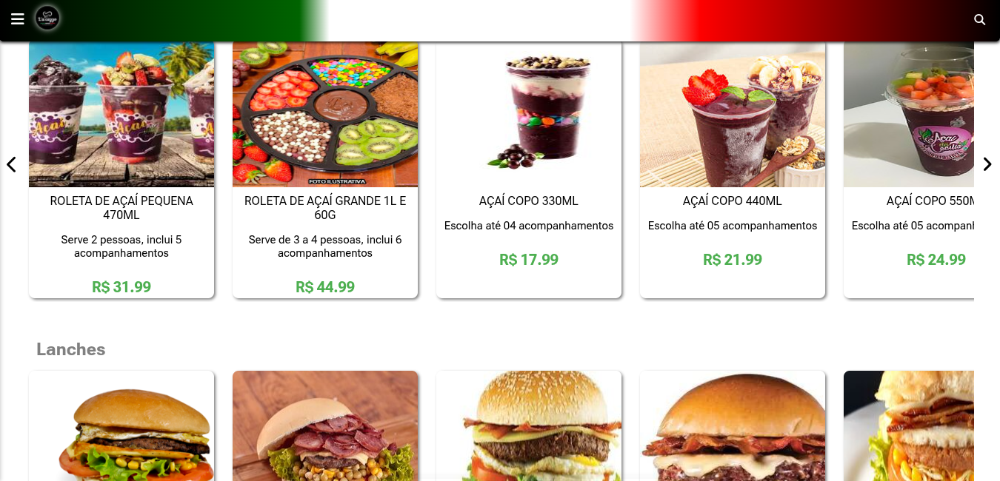
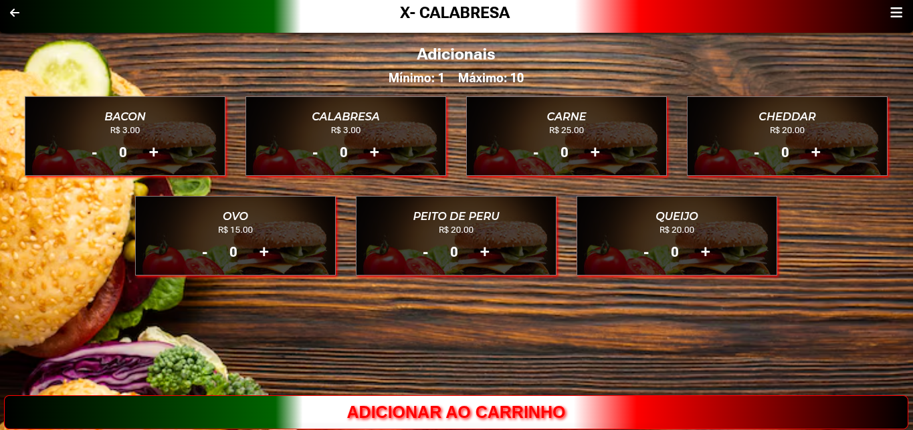
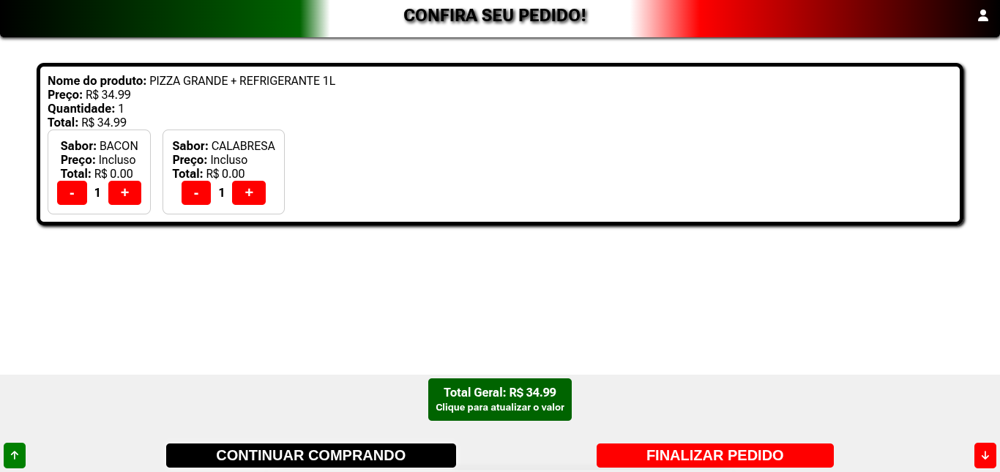
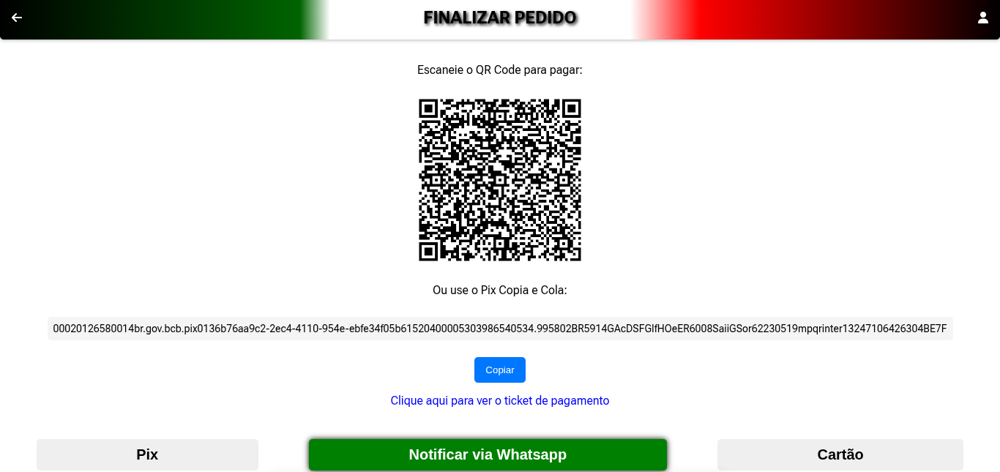
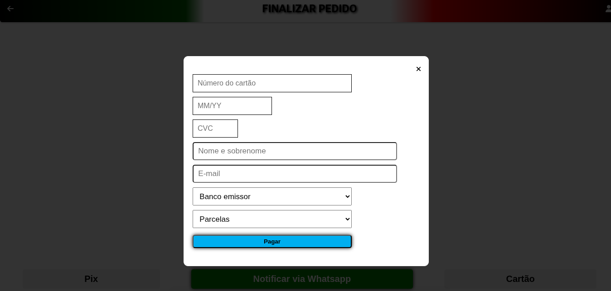

# Cardápio Digital

O Cardápio Digital é uma plataforma delivery fast-food, que gerencia usuários, pedidos, pagamentos e produtos.
Segue abaixo sua página inicial que lista os produtos por categoria. No ícone de menu no canto superior esquerdo é possível acessar a lista das categorias dos produtos.

 
Clicando na imagem do produto o usuário é redirecionado para a página de sabores, onde pode adicioná-los ao produto escolhido, fazendo assim uma espécie de pegue e monte digital.

Abaixo estão o carrinho de produtos e a página de meios de pagamento, onde o cliente pode optar por cartão ou pix. E se caso ache melhor pode realizar o pagamento diretamente com o vendedor via Whatsapp.

 
A primeira página é a do carrinho, nela você pode alterar a quantidade de sabores ou até removê-los caso queira. As demais páginas são as formas de pagamento, pix, cartõ ou falar diretamente via Whatsapp. Após finalizado o pedido o cliente poderá vê-lo na página do seu perfil clicando no ícone 👤 superior direito da tela.
  

>Link da aplicação: https://max-menu.vercel.app/

>Documentação da API: https://app.swaggerhub.com/apis-docs/MESMO245/APICardapioDigital/1.0.0  
